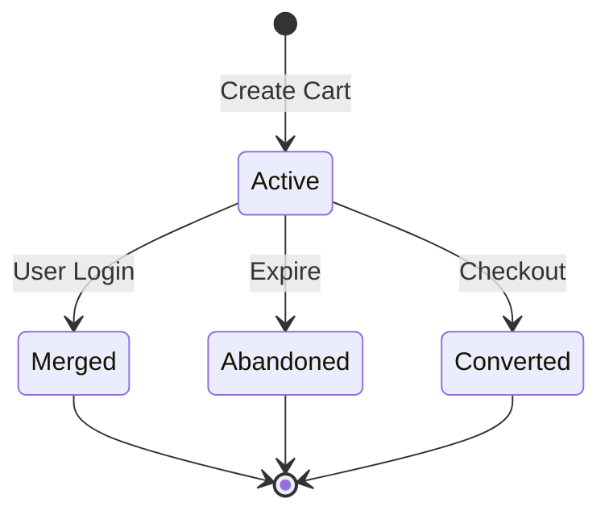

# Cart API Documentation

## Table of Contents
- [Base URL](#base-url)
- [Overview](#overview)
- [Authentication](#authentication)
- [Public Endpoints](#public-endpoints)
  - [Get Current Cart](#get-current-cart)
  - [Add to Cart](#add-to-cart)
  - [Update Cart Item](#update-cart-item)
  - [Remove Cart Item](#remove-cart-item)
  - [Clear Cart](#clear-cart)
  - [Get Cart Summary](#get-cart-summary)
  - [Apply Coupon](#apply-coupon)
  - [Remove Coupon](#remove-coupon)
- [Protected Endpoints](#protected-endpoints)
  - [Merge Carts](#merge-carts)
  - [Save for Later](#save-for-later)
  - [Move to Cart](#move-to-cart)
- [Cart Lifecycle](#cart-lifecycle)
- [Error Handling](#error-handling)
- [Rate Limiting](#rate-limiting)

## Base URL
```http
http://localhost:8000/api/cart
```

## Overview
API for managing shopping carts including guest carts, user carts, and cart merging.

## Authentication
- Guest carts: Session cookie
- User carts: `Authorization: Bearer <token>`

## Endpoints

### 1. Get Current Cart
Get active cart for current user/session.

```http
GET /cart
```

#### Query Parameters
| Parameter | Type    | Description           | Default |
|-----------|---------|----------------------|---------|
| include   | string  | Additional data      | -       |
| calculate | boolean | Include calculations | false   |

#### Response (200 OK)
```json
{
  "id": "cart-uuid",
  "status": "active",
  "itemCount": 2,
  "items": [
    {
      "id": "item-uuid",
      "productId": "product-uuid",
      "quantity": 2,
      "price": 29.99,
      "specifications": {
        "width": "53cm",
        "length": "10.05m"
      },
      "product": {
        "name": "Floral Wallpaper",
        "featuredImage": "/images/floral.jpg",
        "stockQuantity": 100
      }
    }
  ],
  "subtotal": 59.98,
  "discount": 0,
  "tax": 6.00,
  "total": 65.98,
  "coupon": null
}
```

### 2. Add to Cart
Add product to current cart.

```http
POST /cart
```

#### Request Body
| Field          | Type    | Required | Description              |
|----------------|---------|----------|--------------------------|
| productId      | string  | Yes      | Product ID              |
| quantity       | number  | Yes      | Quantity (> 0)          |
| specifications | object  | No       | Product specifications  |

```json
{
  "productId": "product-uuid",
  "quantity": 2,
  "specifications": {
    "width": "53cm",
    "length": "10.05m"
  }
}
```

#### Response (201 Created)
```json
{
  "id": "item-uuid",
  "productId": "product-uuid",
  "quantity": 2,
  "price": 29.99,
  "specifications": {
    "width": "53cm",
    "length": "10.05m"
  }
}
```

### 3. Update Cart Item
Update quantity or specifications.

```http
PUT /cart/items/:id
```

#### Request Body
```json
{
  "quantity": 3,
  "specifications": {
    "width": "53cm"
  }
}
```

#### Response (200 OK)
```json
{
  "id": "item-uuid",
  "quantity": 3,
  "specifications": {
    "width": "53cm"
  }
}
```

### 4. Remove Cart Item
Remove item from cart.

```http
DELETE /cart/items/:id
```

#### Response (200 OK)
```json
{
  "message": "Item removed from cart"
}
```

### 5. Clear Cart
Remove all items from cart.

```http
DELETE /cart
```

#### Response (200 OK)
```json
{
  "message": "Cart cleared"
}
```

### 6. Apply Coupon
Apply coupon to cart.

```http
POST /cart/coupon
```

#### Request Body
```json
{
  "code": "SAVE10"
}
```

#### Response (200 OK)
```json
{
  "code": "SAVE10",
  "discount": 10.00,
  "type": "percentage",
  "message": "Coupon applied successfully"
}
```

### 7. Remove Coupon
Remove applied coupon.

```http
DELETE /cart/coupon
```

#### Response (200 OK)
```json
{
  "message": "Coupon removed"
}
```

### 8. Get Cart Summary
Get cart totals and counts.

```http
GET /cart/summary
```

#### Response (200 OK)
```json
{
  "itemCount": 2,
  "subtotal": 59.98,
  "discount": 10.00,
  "shipping": 5.00,
  "tax": 6.00,
  "total": 60.98
}
```

### 9. Merge Carts (Protected)
Merge guest cart into user cart.

```http
POST /cart/merge
```

#### Response (200 OK)
```json
{
  "message": "Carts merged successfully",
  "cart": {
    "id": "cart-uuid",
    "items": []
  }
}
```

### 10. Save for Later (Protected)
Move item to saved items list.

```http
POST /cart/items/:id/save
```

#### Response (200 OK)
```json
{
  "id": "item-uuid",
  "status": "saved"
}
```

### 11. Move to Cart (Protected)
Move saved item back to cart.

```http
POST /cart/items/:id/move
```

#### Response (200 OK)
```json
{
  "id": "item-uuid",
  "status": "active"
}
```

## Error Responses

### 400 Bad Request
```json
{
  "message": "Invalid request",
  "errors": [
    {
      "field": "quantity",
      "message": "Must be greater than 0"
    }
  ]
}
```

### 404 Not Found
```json
{
  "message": "Item not found"
}
```

### 409 Conflict
```json
{
  "message": "Product out of stock",
  "available": 5,
  "requested": 10
}
```

## Cart States
- `active`: Current shopping cart
- `merged`: Guest cart merged with user cart
- `abandoned`: Inactive for 7+ days
- `converted`: Converted to order

## Cart Lifecycle


## Error Handling
All error responses follow this format:
```json
{
  "message": "Error message here",
  "errors": [
    {
      "field": "Field name",
      "message": "Specific error message"
    }
  ]
}
```

Common error responses:

| Code | Description               | Example                        |
|------|---------------------------|--------------------------------|
| 400  | Invalid request data     | Invalid quantity, Invalid coupon |
| 401  | Authentication required  | Token missing or invalid        |
| 404  | Resource not found       | Product or cart item not found  |
| 409  | Conflict                 | Product out of stock            |
| 429  | Too many requests        | Rate limit exceeded             |
| 500  | Server error             | Internal processing error       |

## Rate Limits
- Add/Update: 30 requests/minute
- Get: 60 requests/minute
- Other operations: 20 requests/minute

## Validation Rules
- Quantity must be positive integer
- Product must be in stock
- Specifications must match product type
- Coupon must be valid and applicable

## Best Practices
1. Always check stock availability before adding to cart
2. Handle cart merging during user login
3. Implement cart expiration cleanup
4. Validate specifications against product type
5. Update cart totals after each modification

## Cart Data Structure
```typescript
interface Cart {
  id: string;
  userId?: string;
  sessionId?: string;
  status: 'active' | 'merged' | 'abandoned' | 'converted';
  items: CartItem[];
  coupon?: {
    code: string;
    discount: number;
    type: 'percentage' | 'fixed';
  };
  metadata?: object;
  expiresAt: Date;
  createdAt: Date;
  updatedAt: Date;
}

interface CartItem {
  id: string;
  cartId: string;
  productId: string;
  quantity: number;
  price: number;
  specifications?: object;
  metadata?: object;
}
```

[Continue with examples, security considerations, and other important details...]